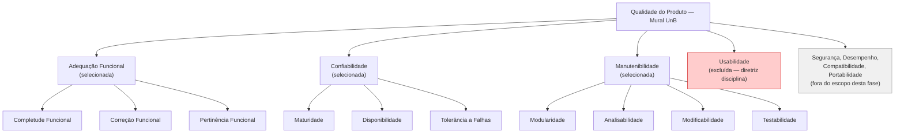

# Fase 1 — Requisitos de Avaliação de Qualidade

## 1. Contexto de Trabalho

Este documento registra a execução da Fase 1 do processo de avaliação de qualidade de software, conforme definido pela família de normas ISO/IEC 25000 (SQuaRE) [1]. A atividade é desenvolvida no âmbito da disciplina Qualidade de Software do curso de Engenharia de Software da FCTE-UnB e tem como objeto de análise a aplicação web **Mural UnB**, disponível em [https://muralunb.com.br](https://muralunb.com.br).

A Fase 1, denominada "Estabelecimento dos Requisitos de Avaliação", tem como objetivo definir o escopo, o propósito e o modelo de qualidade que orientarão as fases subsequentes de especificação e execução da avaliação [2].

---

## 2. Descrição Estruturada do Software Avaliado

O **Mural UnB** é uma plataforma digital desenvolvida pelo projeto MDS/GPP da Universidade de Brasília com o propósito de centralizar e organizar a divulgação de oportunidades, eventos e avisos acadêmicos dirigidos à comunidade universitária. O sistema coleta informações de múltiplas fontes, aplica processamento automatizado com inteligência artificial e as disponibiliza em interface web de acesso público.

### 2.1 Objetivos da Plataforma

O projeto foi concebido para substituir a comunicação dispersa em grupos informais de mensagens e murais físicos, fornecendo um canal estruturado e categorizado de informações. Entre as finalidades declaradas no repositório oficial [3], destacam-se:

- centralização de oportunidades acadêmicas (bolsas, estágios, eventos);
- categorização e filtragem de conteúdo por relevância;
- automação do processo de coleta, processamento e publicação de dados; e
- garantia de integridade e atualização contínua do conteúdo exibido.

### 2.2 Arquitetura Técnica

| Camada | Tecnologia |
|--------|------------|
| Interface | React 18 com TypeScript e Tailwind CSS |
| Processamento de dados | Python (pandas), API Gemini (LLM), GitHub Actions |
| Armazenamento intermediário | JSON |
| Hospedagem e entrega | GitHub Pages |
| Controle de versão e CI/CD | Git, GitHub, GitHub Actions |

A arquitetura é predominantemente estática com geração automatizada de dados: um pipeline de coleta e processamento é executado periodicamente via GitHub Actions, gerando arquivos JSON que alimentam o frontend React implantado no GitHub Pages [3].

---

## 3. Requisitante e Partes Interessadas

Em conformidade com o processo SQuaRE [2], foram identificadas as partes interessadas relevantes para esta avaliação:

| Papel | Identificação |
|-------|--------------|
| Requisitante da avaliação | Professora Cristiane Ramos — disciplina Qualidade de Software (FCTE-UnB) |
| Avaliadores | Grupo Irmã Mary Keller — T02, 2026-1 |
| Desenvolvedores do produto | Equipe MDS/GPP UnB — projeto 2025-2-Mural-UnB |
| Usuários finais | Discentes e docentes da Universidade de Brasília |
| Operadores | Mantenedores do repositório GitHub da aplicação |
| Beneficiários institucionais | Secretaria de Comunicação e coordenações de curso da UnB |

---

## 4. Classificação do Tipo de Produto

A classificação do produto segue os critérios estabelecidos pela ISO/IEC 25010 [1] para categorização de sistemas de software:

| Aspecto | Caracterização |
|---------|---------------|
| Tipo de software | Aplicação web de acesso público |
| Categoria funcional | Sistema de mural digital e agregação de conteúdo acadêmico |
| Natureza de uso | Leitura pública sem autenticação; administração por pipeline automatizado |
| Modelo de implantação | Hospedagem estática (GitHub Pages) com CI/CD automatizado |
| Natureza do código | Código aberto (open source), desenvolvido em contexto acadêmico |
| Ciclo de vida esperado | Projeto de duração semestral com possibilidade de continuidade por turmas futuras |

A natureza open source e o ciclo de vida acadêmico são aspectos determinantes para a seleção das características de qualidade avaliadas, conforme detalhado na seção 7.

---

## 5. Propósito da Avaliação e Uso Pretendido dos Resultados

O propósito desta avaliação é verificar, de forma sistemática e baseada em evidências, em que medida o Mural UnB satisfaz requisitos de qualidade relevantes para um sistema de informação acadêmica de acesso público, desenvolvido e mantido em contexto de aprendizagem.

Os resultados produzidos serão utilizados para:

1. **documentar o estado de qualidade atual** do software em relação às características selecionadas, fornecendo uma linha de base para comparações futuras;
2. **identificar não conformidades e oportunidades de melhoria** que possam ser comunicadas à equipe de desenvolvimento como contribuição ao projeto; e
3. **subsidiar as Fases 2 e 3** da avaliação SQuaRE, que compreenderão a especificação das métricas, a execução das medições e a apresentação dos resultados consolidados.

Os resultados não têm como objetivo classificar ou reprovar o software, mas sim produzir conhecimento técnico aplicado e demonstrar o domínio do processo de avaliação pelos avaliadores [2].

---

## 6. Modelo de Qualidade — ISO/IEC 25010 e Adaptação

O modelo de referência adotado é o definido pela ISO/IEC 25010:2011 [1], que organiza a qualidade do produto de software em oito características principais. Para esta avaliação, o modelo foi adaptado ao contexto específico do Mural UnB, restringindo o escopo a três características consideradas prioritárias. A característica **Usabilidade** foi explicitamente excluída por determinação metodológica da disciplina [4].

### 6.1 Representação Gráfica do Modelo Adaptado

### 6.2 Descrição das Subcaracterísticas Avaliadas

**Adequação Funcional** — avalia se as funções fornecidas cobrem as tarefas e objetivos declarados dos usuários com a abrangência e a precisão necessárias [1]. As subcaracterísticas relevantes para o Mural UnB são:

- *Completude Funcional*: verificação se todas as funções esperadas para um mural digital (listagem, filtragem, categorização, atualização) estão implementadas;
- *Correção Funcional*: verificação se o sistema produz resultados corretos com o nível de precisão necessário; e
- *Pertinência Funcional*: avaliação de se as funções implementadas facilitam o cumprimento do propósito declarado sem incluir funções desnecessárias.

**Confiabilidade** — avalia em que grau o sistema executa funções especificadas sob condições definidas por um período de tempo determinado [1]. As subcaracterísticas relevantes são:

- *Maturidade*: frequência com que o sistema apresenta falhas em operação normal;
- *Disponibilidade*: capacidade do sistema de estar acessível e operacional quando requisitado; e
- *Tolerância a Falhas*: capacidade de o sistema operar como pretendido na presença de falhas de hardware ou software.

**Manutenibilidade** — avalia a eficácia e eficiência com que o sistema pode ser modificado para correção, melhoria ou adaptação ao ambiente [1]. As subcaracterísticas relevantes são:

- *Modularidade*: grau em que o sistema é composto de componentes discretos, de forma que mudanças em um componente tenham impacto mínimo sobre os demais;
- *Analisabilidade*: facilidade de diagnosticar deficiências ou identificar partes que precisam ser modificadas;
- *Modificabilidade*: facilidade de realização de modificações sem introdução de defeitos; e
- *Testabilidade*: facilidade de estabelecer critérios de teste para o sistema e de verificar se eles foram satisfeitos.

---

## 7. Características Selecionadas — Critérios de Priorização

### 7.1 Critérios Adotados

A seleção e priorização das características seguiu quatro critérios, derivados do propósito declarado e do tipo de produto identificado na seção 4:

**Critério C1 — Criticidade para o propósito declarado**: quanto a ausência ou falha na característica compromete o objetivo central do sistema (mural acadêmico de informações confiáveis).

**Critério C2 — Mensurabilidade objetiva**: existência de métricas e procedimentos de medição estabelecidos pela ISO/IEC 25023 [5] que possam ser aplicados ao artefato avaliado sem instrumentação invasiva.

**Critério C3 — Impacto sobre os usuários finais**: extensão do prejuízo causado a discentes e docentes em caso de não conformidade com a característica.

**Critério C4 — Relevância para o contexto open source acadêmico**: importância da característica para a sustentabilidade do projeto ao longo de múltiplos semestres e equipes de desenvolvimento distintas.

### 7.2 Aplicação dos Critérios

| Característica | C1 — Criticidade | C2 — Mensurabilidade | C3 — Impacto usuário | C4 — Open source | Prioridade |
|----------------|:-:|:-:|:-:|:-:|:-:|
| Adequação Funcional | Alta | Alta | Alto | Média | 1 |
| Confiabilidade | Alta | Alta | Alto | Média | 2 |
| Manutenibilidade | Média-Alta | Alta | Indireto | Alta | 3 |

### 7.3 Relação das Características com o Propósito Declarado

A **Adequação Funcional** é a característica com maior alinhamento ao propósito, pois um mural digital que não cobre as funções esperadas (exibição, categorização e atualização de oportunidades acadêmicas) falha em sua razão de existir, independentemente de outros atributos de qualidade.

A **Confiabilidade** é diretamente relacionada ao propósito porque a utilidade do sistema é nula quando ele está indisponível ou exibe dados desatualizados. Considerando que a atualização depende de pipelines automatizados (GitHub Actions), falhas nesse pipeline afetam a confiabilidade percebida pelo usuário.

A **Manutenibilidade** sustenta o propósito no horizonte temporal do projeto: como o desenvolvimento é conduzido por equipes de estudantes que se renovam a cada semestre, a capacidade de compreender e modificar o código é condição necessária para a evolução contínua das funcionalidades e a correção de defeitos identificados.

A relação entre as três características será analisada nos resultados finais: espera-se que baixa manutenibilidade aumente a incidência de defeitos funcionais e de confiabilidade, e que falhas de adequação funcional indiquem necessidade de refatoração que demanda alta manutenibilidade.

---

## 8. Escopo, Profundidade e Objetos de Avaliação

### 8.1 Escopo

A avaliação abrange o produto de software implantado em [https://muralunb.com.br](https://muralunb.com.br) e o código-fonte disponível no repositório [3], considerando:

- interface web pública (frontend React);
- pipeline de coleta e processamento de dados (scripts Python e workflows GitHub Actions); e
- documentação técnica disponível no repositório.

O backend de banco de dados (quando aplicável) e aspectos de infraestrutura de rede estão fora do escopo desta avaliação, por não serem acessíveis para inspeção pelos avaliadores.

### 8.2 Profundidade

| Tipo de Análise | Aplicação |
|-----------------|-----------|
| Inspeção de código-fonte | Análise estática de modularidade, analisabilidade e testabilidade |
| Testes funcionais (caixa-preta) | Verificação de completude, correção e pertinência funcional |
| Monitoramento de disponibilidade | Verificação de acessibilidade e tempo de resposta do sistema implantado |
| Análise de histórico de falhas | Inspeção de issues e releases no repositório GitHub |

### 8.3 Relação com Avaliações Futuras

Esta Fase 1 estabelece os requisitos que orientarão:

- **Fase 2** (Especificação da Avaliação): definição de métricas, procedimentos de medição e critérios de julgamento para cada subcaracterística selecionada;
- **Fase 3** (Execução da Avaliação): coleta de dados brutos, aplicação das métricas e consolidação dos resultados; e
- **Fase 4** (Conclusão): elaboração do relatório final com relação entre as características avaliadas e recomendações de melhoria.

Não há avaliações anteriores deste software pelos avaliadores que possam ser utilizadas como linha de base comparativa.

---

## 9. Objetivos de Desenvolvimento Sustentável Relacionados

O Mural UnB conecta-se a objetivos da Agenda 2030 da ONU [6] que são diretamente relevantes à sua função de plataforma de comunicação acadêmica aberta.

### ODS 4 — Educação de Qualidade

| Meta | Indicador | Vínculo com o Mural UnB |
|------|-----------|------------------------|
| 4.3 — Garantir acesso igual a ensino técnico, profissional e de nível superior de qualidade | 4.3.1 — Taxa de participação de jovens e adultos em educação formal e não formal | A plataforma amplia o acesso a informações sobre bolsas, monitorias e eventos que viabilizam a permanência estudantil e o aproveitamento acadêmico |
| 4.b — Ampliar o número de bolsas de estudo disponíveis | — | O sistema agrega e divulga oportunidades de bolsas e estágios, reduzindo a assimetria de informação entre estudantes |

### ODS 16 — Paz, Justiça e Instituições Eficazes

| Meta | Indicador | Vínculo com o Mural UnB |
|------|-----------|------------------------|
| 16.6 — Desenvolver instituições eficazes, responsáveis e transparentes | 16.6.2 — Proporção da população satisfeita com experiência mais recente dos serviços públicos | A plataforma melhora a eficácia da comunicação institucional da UnB, tornando informações públicas mais acessíveis e organizadas |
| 16.10 — Assegurar o acesso público à informação | 16.10.2 — Número de países que garantem acesso público à informação | O sistema implementa, em nível institucional, o princípio de acesso público à informação acadêmica |

### ODS 9 — Indústria, Inovação e Infraestrutura

| Meta | Indicador | Vínculo com o Mural UnB |
|------|-----------|------------------------|
| 9.b — Apoiar o desenvolvimento de tecnologia, pesquisa e inovação nacionais | — | O projeto fomenta o desenvolvimento de tecnologias abertas por estudantes de engenharia, contribuindo para a formação de capacidade técnica nacional |

---

## 10. Referências Bibliográficas

- [1] ISO/IEC 25010:2011. *Systems and software engineering — Systems and software Quality Requirements and Evaluation (SQuaRE) — System and software quality models*. International Organization for Standardization, 2011.
- [2] ISO/IEC 25040:2011. *Systems and software engineering — SQuaRE — Evaluation process*. International Organization for Standardization, 2011.
- [3] Mural UnB. Repositório do projeto. GitHub, 2025. Disponível em: [https://github.com/unb-mds/2025-2-Mural-UnB](https://github.com/unb-mds/2025-2-Mural-UnB). Acesso em: maio 2026.
- [4] RAMOS, Cristiane. *Roteiro da Disciplina Qualidade de Software — 2026-1*. FCTE-UnB, 2026. (Documento interno da disciplina.)
- [5] ISO/IEC 25023:2016. *Systems and software engineering — SQuaRE — Measurement of system and software product quality*. International Organization for Standardization, 2016.
- [6] ONU BRASIL. *Objetivos de Desenvolvimento Sustentável*. Disponível em: [https://brasil.un.org/pt-br/sdgs](https://brasil.un.org/pt-br/sdgs). Acesso em: maio 2026.
