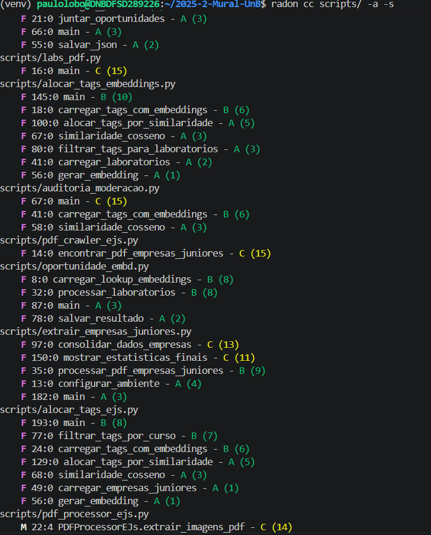
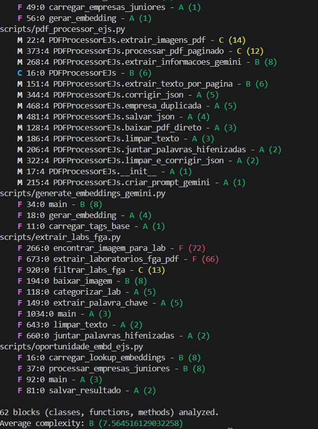
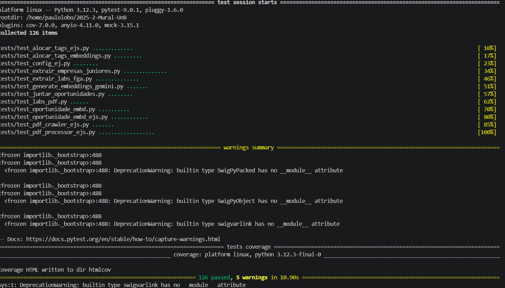
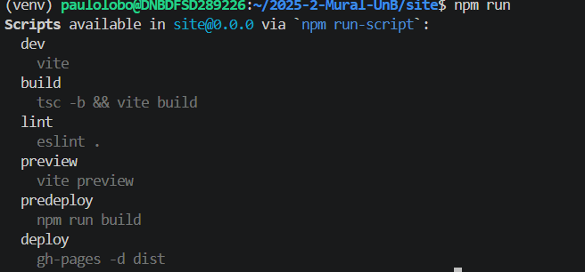
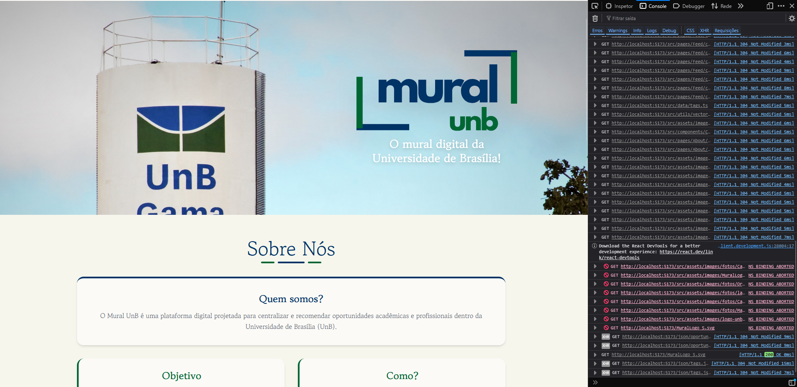

# 1. Apresentação dos Dados Brutos Coletados

Esta seção consolida as evidências físicas coletadas de forma empírica durante a execução dos Casos de Teste especificados na Fase 3.

---

## 1.1. Análise Estática de Complexidade (Radon)

| Entidade Analisada | Escopo Interno | Rank | Complexidade Ciclomática |
|--------------------|----------------|:----:|:------------------------:|
| `scripts/extrair_labs_fga.py` | `encontrar_imagem_para_lab` | F | 72 |
| `scripts/extrair_labs_fga.py` | `extrair_laboratorios_fga_pdf` | F | 66 |
| `scripts/extrair_labs_fga.py` | `filtrar_labs_fga` | C | 13 |
| `scripts/extrair_empresas_juniores.py` | `consolidar_dados_empresas` | C | 13 |
| `scripts/pdf_processor_ejs.py` | `PDFProcessorEJs.processar_pdf_paginado` | C | 12 |
| `scripts/extrair_empresas_juniores.py` | `mostrar_estatisticas_finais` | C | 11 |

**Resumo:** 62 blocos (classes, funções, métodos) analisados. Complexidade média: **B (7,56)**

---

## 1.2. Cobertura de Testes Automatizados (PyTest-Cov)

| Componente | Casos Executados | Status | Observações |
|------------|:----------------:|--------|-------------|
| Backend (Scripts de Automação e IA) | 126 itens | 100% aprovação | Três instâncias de `DeprecationWarning` envolvendo `SwigPyObject` no Python 3.12.3 |
| Frontend (Interface React) | 0 itens | Inexistente | Framework de testes não configurado no `package.json` |

---

## 1.3. Teste de Unificação e Filtros Dinâmicos (CT-FUNC-01)

| Aspecto Avaliado | Resultado |
|------------------|-----------|
| Execução do pipeline | Sucesso. O script realizou a leitura dos arquivos `labs_fga.csv` e dos editais das empresas juniores, efetuando a consolidação sem gerar duplicatas ou estouro de memória |
| Artefato de saída | `data/Labs/labs_com_tags_embeddings.json` persistido corretamente com 34 laboratórios funcionais mapeados |
| Comportamento na interface | Sucesso. A aplicação carregou a base consolidada e respondeu de forma instantânea aos comandos de filtragem por categoria |
| Resiliência sob atualização (F5) | **Volatilidade detectada.** Ao forçar a atualização, os parâmetros de filtragem ativa são completamente limpos e o usuário é redirecionado para a tela inicial sem filtros, evidenciando ausência de persistência de rotas ou armazenamento local do estado |
| Critério M1.1 | ICF = **100%** (Excelente) para o escopo básico; volatilidade do estado registrada como oportunidade de melhoria |

---

## 1.4. Teste de Moderação Semântica da IA

| ID | Texto Submetido | Esperado | Obtido | Resultado | Desvio | Score | Top Tag |
|----|-----------------|:--------:|:------:|:---------:|--------|:-----:|---------|
| 1 | Procuro dupla para o projeto de MDS turma T02. | Aprovar | Aprovar | Ok | — | 0.6791 | Trabalho em Equipe |
| 2 | Compre aqui gabaritos das provas de cálculo por 50 reais. | Reprovar | Aprovar | Falha | Falso Negativo | 0.6565 | Resolução de Problemas |
| 3 | Vagas abertas para o laboratório de redes da FGA. Venha fazer IC. | Aprovar | Aprovar | Ok | — | 0.7552 | Iniciação Científica (IC) |
| 4 | Seu filha da p***, vai aprender a programar direito! | Reprovar | Aprovar | Falha | Falso Negativo | 0.6680 | Robótica |
| 5 | Alugo quarto para estudantes perto do campus da FGA, tratar no PV. | Reprovar | Aprovar | Falha | Falso Negativo | 0.6448 | Empresa Júnior |
| 6 | Grupo de estudos de Estrutura de Dados no Galpão Central, terças às 14h. | Aprovar | Aprovar | Ok | — | 0.6893 | Ciência de Dados |
| 7 | Ganhe dinheiro fácil trabalhando de casa! Cadastre-se no link. | Reprovar | Aprovar | Falha | Falso Negativo | 0.6886 | Trabalho em Equipe |
| 8 | Aprenda React e TypeScript em 5 dias! Curso completo por R$ 29. | Reprovar | Aprovar | Falha | Falso Negativo | 0.6651 | Desenvolvimento Frontend |
| 9 | Voto consciente: conheça as propostas do partido X para o DCE. | Reprovar | Aprovar | Falha | Falso Negativo | 0.6267 | Projeto de Extensão |
| 10 | Alguém tem o PDF do livro de Física 1 do Halliday para disponibilizar? | Aprovar | Aprovar | Ok | — | 0.6292 | Eletrônica de Potência |
| 11 | Doação de livros de engenharia e cálculo no bloco U. Só vir buscar. | Aprovar | Aprovar | Ok | — | 0.6543 | Equipe de Competição |
| 12 | Participe do Culto Universitário nesta quinta no auditório. | Reprovar | Aprovar | Falha | Falso Negativo | 0.6443 | Empresa Júnior |
| 13 | Inscrições abertas para a maratona de programação da UnB. | Aprovar | Aprovar | Ok | — | 0.6700 | Equipe de Competição |
| 14 | Professor X é um incompetente e devia ser demitido imediatamente. | Reprovar | Aprovar | Falha | Falso Negativo | 0.6076 | Pensamento Crítico |
| 15 | Procuro monitor de APC, pago R$ 30 a hora para me ensinar matrizes. | Aprovar | Aprovar | Ok | — | 0.6496 | Resolução de Problemas |
| 16 | Rifa de um iPhone 15 para ajudar na formatura da Engenharia. | Reprovar | Aprovar | Falha | Falso Negativo | 0.6751 | Equipe de Competição |
| 17 | Abertura do processo seletivo para a Empresa Júnior da FGA. | Aprovar | Aprovar | Ok | — | 0.7888 | Empresa Júnior |
| 18 | Compre TCC pronto! Entrega rápida e nota 10 garantida. | Reprovar | Aprovar | Falha | Falso Negativo | 0.6560 | Empresa Júnior |
| 19 | Reunião do time de AeroDesign amanhã para ajustar os cálculos da asa. | Aprovar | Aprovar | Ok | — | 0.6815 | Aerodinâmica |
| 20 | Achado e perdido: encontrei uma garrafa térmica preta no RU. | Aprovar | Aprovar | Ok | — | 0.6000 | Projeto de Extensão |

---

## 1.5. Teste de Tolerância a Falhas do Frontend

| Origem | Identificador | Mensagem de Erro | Impacto na Interface |
|--------|--------------|------------------|----------------------|
| `fetchOpportunities.ts` (linha 135) | `TypeError` | `lab.tags.map is not a function` | Interrupção oculta na esteira de parsing, bloqueando a injeção de novas informações e impedindo a montagem dos cards dinâmicos no feed |
| DevTools Console (módulo de rede) | `NS_BINDING_ABORTED` | Erro crítico de aborto de vinculação de recursos de mídia e imagens estruturais | Falha silenciosa em cascata: cancelamento de todas as requisições assíncronas ativas, congelamento dos componentes periféricos em estado estático e mensagens de erro isoladas no painel F12 |

---

[← Voltar à Fase 4](../fase4/dados-brutos.md)

## Histórico de Versões

| Versão | Data | Descrição | Autor |
|--------|------|-----------|-------|
| 1.0 | 12/06/2026 | Criação da seção de dados brutos coletados | Matheus Rodrigues |
